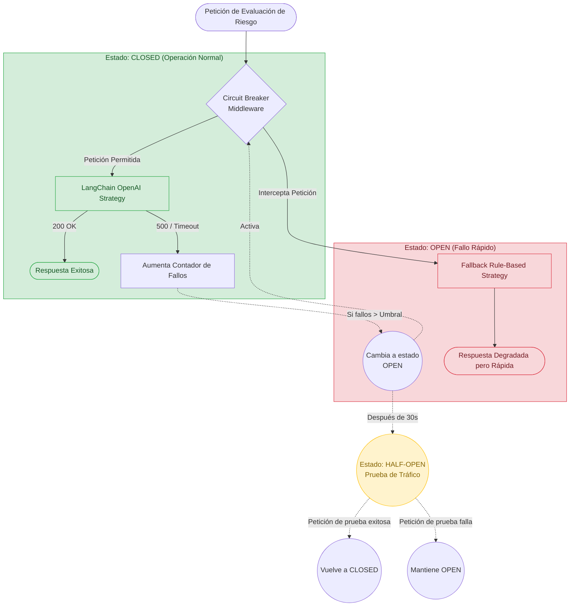
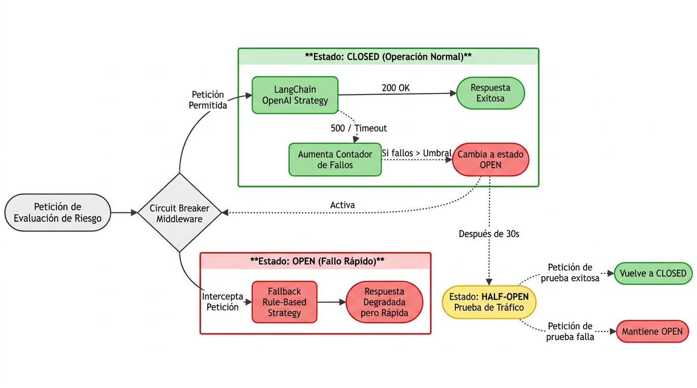

# Circuit Breaker Diagram

```mermaid
graph TD
    Request([Petición de Evaluación de Riesgo]) --> CB{Circuit Breaker\nMiddleware}

    subgraph Estado_Cerrado ["Estado: CLOSED (Operación Normal)"]
        CB -- Petición Permitida --> OAI[LangChain OpenAI Strategy]
        OAI -- 200 OK --> Response([Respuesta Exitosa])
        OAI -- 500 / Timeout --> ErrorCounter[Aumenta Contador de Fallos]
    end

    ErrorCounter -. Si fallos > Umbral .-> OpenState((Cambia a estado\nOPEN))

    subgraph Estado_Abierto ["Estado: OPEN (Fallo Rápido)"]
        OpenState -. Activa .-> CB
        CB -- Intercepta Petición --> Fallback[Fallback Rule-Based Strategy]
        Fallback --> FallbackResponse([Respuesta Degradada pero Rápida])
    end
    
    %% Transición de recuperación
    OpenState -. Después de 30s .-> HalfOpen((Estado: HALF-OPEN\nPrueba de Tráfico))
    HalfOpen -. Petición de prueba exitosa .-> Cerrar((Vuelve a CLOSED))
    HalfOpen -. Petición de prueba falla .-> Abrir((Mantiene OPEN))

    classDef closed fill:#d4edda,stroke:#28a745,color:#155724;
    classDef open fill:#f8d7da,stroke:#dc3545,color:#721c24;
    classDef warning fill:#fff3cd,stroke:#ffc107,color:#856404;
    
    class Estado_Cerrado,OAI,Response closed;
    class Estado_Abierto,Fallback,FallbackResponse open;
    class HalfOpen warning;
```

