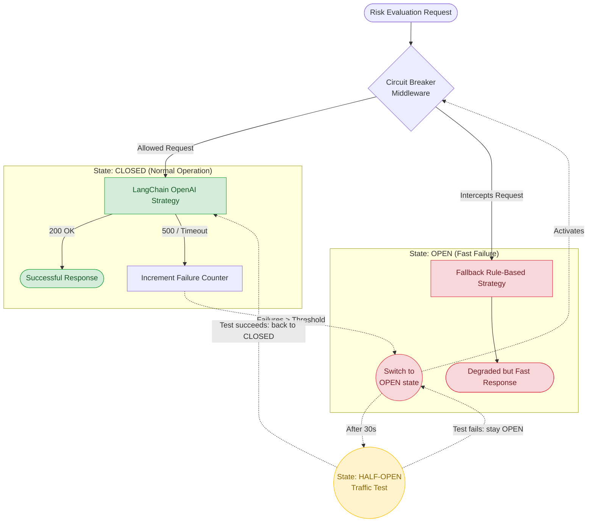
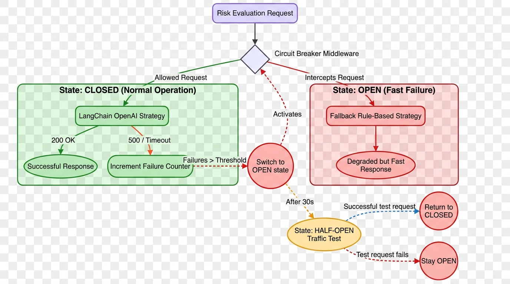

# Circuit Breaker Diagram (English)

```mermaid
graph TD
    Request([Risk Evaluation Request]) --> CB{"Circuit Breaker<br/>Middleware"}

    subgraph ClosedState ["State: CLOSED (Normal Operation)"]
        OAI[LangChain OpenAI Strategy]
        Response([Successful Response])
        ErrorCounter[Increment Failure Counter]
    end

    subgraph OpenStateGroup ["State: OPEN (Fast Failure)"]
        OpenState(("Switch to<br/>OPEN state"))
        Fallback[Fallback Rule-Based Strategy]
        FallbackResponse([Degraded but Fast Response])
    end

    HalfOpen(("State: HALF-OPEN<br/>Traffic Test"))

    CB -- Allowed Request --> OAI
    OAI -- 200 OK --> Response
    OAI -- 500 / Timeout --> ErrorCounter
    ErrorCounter -. Failures > Threshold .-> OpenState

    OpenState -. Activates .-> CB
    CB -- Intercepts Request --> Fallback
    Fallback --> FallbackResponse

    OpenState -. After 30s .-> HalfOpen
    HalfOpen -. Test succeeds: back to CLOSED .-> OAI
    HalfOpen -. Test fails: stay OPEN .-> OpenState

    classDef closed fill:#d4edda,stroke:#28a745,color:#155724;
    classDef open fill:#f8d7da,stroke:#dc3545,color:#721c24;
    classDef warning fill:#fff3cd,stroke:#ffc107,color:#856404;

    class OAI,Response closed;
    class OpenState,Fallback,FallbackResponse open;
    class HalfOpen warning;
```

Implementation status: [../architecture-design.md](../architecture-design.md#4-resilience-circuit-breaker-and-graceful-degradation)
